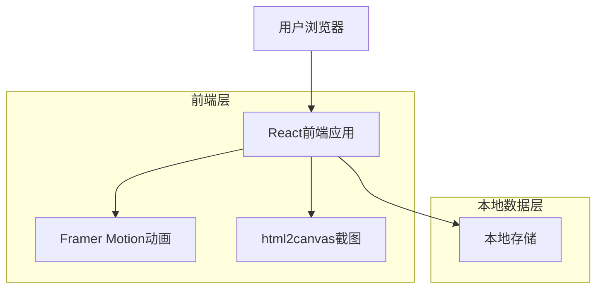

## 1. 架构设计



## 2. 技术栈描述
- **前端框架**：React@18 + Vite
- **样式框架**：Tailwind CSS@3
- **动画库**：Framer Motion@10
- **截图库**：html2canvas@1.4
- **初始化工具**：vite-init
- **AI服务**：OpenAI SDK + DashScope API
- **后端**：无（纯前端应用，AI调用直接从前端发起）
- **数据库**：无（使用localStorage进行本地存储）

## 3. 路由定义
| 路由 | 用途 |
|-------|---------|
| / | 主页面，情绪输入和销毁选择 |
| /feedback | 反馈页面，显示销毁动画和积极反馈 |

## 4. 核心组件结构

### 4.1 主页面组件
```typescript
interface EmotionInputProps {
  onSubmit: (emotion: string, method: DestructionMethod) => void;
}

type DestructionMethod = 'burn' | 'crumple' | 'delete' | 'shredder' | 'blackhole';
```

### 4.2 动画组件
```typescript
interface AnimationProps {
  method: DestructionMethod;
  onComplete: () => void;
}

// 新增动画组件
interface BurnAnimationProps extends AnimationProps {
  text: string;
}

interface CrumpleAnimationProps extends AnimationProps {
  text: string;
}

interface DeleteAnimationProps extends AnimationProps {
  text: string;
}

interface ShredderAnimationProps extends AnimationProps {
  text: string;
}

interface BlackHoleAnimationProps extends AnimationProps {
  text: string;
}
```

### 4.3 反馈组件
```typescript
interface FeedbackProps {
  quote: string;
  onRestart: () => void;
  onSaveImage?: () => void;
}

// 截图功能
interface ScreenshotService {
  captureElement: (element: HTMLElement) => Promise<string>;
  downloadImage: (dataUrl: string, filename: string) => void;
}
```

## 5. 本地数据管理

### 5.1 数据结构
```typescript
interface EmotionRecord {
  id: string;
  content: string;
  method: DestructionMethod;
  timestamp: number;
  quote: string;
}

interface AppState {
  currentEmotion: string;
  destructionMethod: DestructionMethod;
  showFeedback: boolean;
  currentQuote: string;
  isAnimating: boolean;
}
```

### 5.2 本地存储方案
- **localStorage键**：`emotion_trash_records`
- **存储内容**：用户销毁记录（可选功能）
- **缓存策略**：最近5条记录，用于用户回顾

## 6. 动画实现方案

### 6.1 燃烧动画（增强版）
- 使用Framer Motion的`motion.div`和`AnimatePresence`
- 实现多层火焰粒子效果，颜色渐变从红到黄到蓝
- 烟雾扩散效果使用`filter: blur()`和`opacity`
- 文字逐渐变黑并消散，添加火花四溅效果
- 动画时长：2.5秒

### 6.2 揉皱动画（增强版）
- 使用`rotate`、`scale`和`skew`变换组合
- 模拟真实纸张揉皱的褶皱效果
- 阴影动态变化增强立体感
- 文字逐渐模糊并出现撕裂效果
- 动画时长：2秒

### 6.3 删除动画（增强版）
- 使用`opacity`、`scale`和`filter: blur()`动画
- 文字逐渐透明并缩小，添加闪烁效果
- 粒子消散效果使用多个小元素随机运动
- 简单直接的消失效果，但更加流畅
- 动画时长：1.5秒

### 6.4 碎纸机动画（新增）
- 模拟纸张被切割成条状的效果
- 使用`clip-path`创建条状分割
- 逐条吸入机器，添加重力下落效果
- 机器内部齿轮转动动画
- 动画时长：3秒

### 6.5 黑洞动画（新增）
- 文字被扭曲拉伸，使用`filter: distort`
- 螺旋式吸入黑洞中心，使用`rotate`和`scale`
- 添加星光效果和引力场视觉
- 空间扭曲效果增强真实感
- 动画时长：2.5秒

## 7. 截图功能实现

### 7.1 html2canvas集成
```typescript
import html2canvas from 'html2canvas';

const captureFeedbackCard = async (element: HTMLElement): Promise<string> => {
  const canvas = await html2canvas(element, {
    backgroundColor: '#ffffff',
    scale: 2, // 高分辨率
    useCORS: true,
    allowTaint: true
  });
  
  return canvas.toDataURL('image/png');
};

const downloadImage = (dataUrl: string, filename: string) => {
  const link = document.createElement('a');
  link.download = filename;
  link.href = dataUrl;
  link.click();
};
```

### 7.2 截图优化
- **分辨率**：使用2倍缩放保证图片清晰度
- **背景处理**：确保白色背景，避免透明区域
- **跨域支持**：处理可能的跨域图片资源
- **文件命名**：基于时间戳生成唯一文件名

## 8. AI反馈生成服务

### 8.1 DashScope API集成
```typescript
import OpenAI from "openai";

const openai = new OpenAI({
    apiKey: process.env.DASHSCOPE_API_KEY,
    baseURL: "https://dashscope.aliyuncs.com/compatible-mode/v1"
});

const completion = await openai.chat.completions.create({
    model: "qwen3-max",
    messages: [
        { role: "system", content: "你是一个专业的情绪支持助手，请根据用户的情绪内容提供温暖、积极的反馈建议。" },
        { role: "user", content: userEmotionContent }
    ],
    stream: true
});
```

### 8.2 AI反馈处理逻辑
- **输入处理**：将用户情绪内容发送给AI模型
- **流式响应**：使用流式输出实时显示AI生成的反馈
- **错误处理**：网络异常时显示预设的本地备用反馈
- **缓存机制**：相同情绪内容的反馈结果缓存5分钟

## 9. 性能优化

### 9.1 代码分割
- 路由级别的代码分割
- 动画组件懒加载
- 减少初始包体积

### 9.2 动画优化
- 使用`transform`和`opacity`属性
- 启用硬件加速
- 避免布局抖动
- 使用`will-change`属性优化动画性能

### 9.3 截图性能
- 异步处理截图操作
- 优化DOM元素数量
- 使用合适的缩放比例

### 9.4 缓存策略
- 静态资源缓存
- 字体文件预加载
- 图片资源优化
- AI反馈结果缓存

## 10. 浏览器兼容性
- **Chrome**：≥ 90
- **Firefox**：≥ 88
- **Safari**：≥ 14
- **Edge**：≥ 90
- **移动端浏览器**：iOS Safari ≥ 14, Chrome Android ≥ 90
- **截图功能**：需要支持Canvas和下载功能的现代浏览器