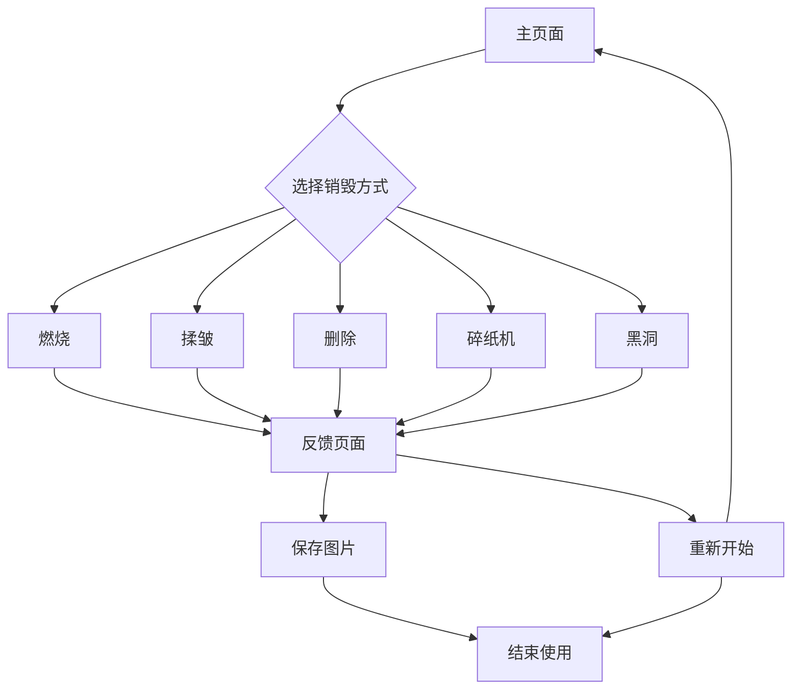

## 1. 产品概述
情绪垃圾桶是一个帮助上班族释放工作压力的Web应用。用户可以在工作间隙倾诉情绪，通过销毁动画释放负面情绪，获得积极的心理反馈。

目标用户：需要情绪宣泄的上班族群体，主要在工作间隙使用。

## 2. 核心功能

### 2.1 用户角色
本应用为匿名使用，无需注册登录。

### 2.2 功能模块
情绪垃圾桶包含以下核心页面：
1. **主页面**：情绪输入区域、销毁动画选择、操作按钮。
2. **反馈页面**：销毁动画展示、积极反馈内容显示、保存图片功能。

### 2.3 页面详情
| 页面名称 | 模块名称 | 功能描述 |
|---------|---------|---------|
| 主页面 | 情绪输入区 | 提供多行文本输入框，用户可输入想要释放的情绪内容 |
| 主页面 | 销毁方式选择 | 提供五种销毁方式：燃烧、揉皱、直接删除、碎纸机、黑洞 |
| 主页面 | 操作按钮 | 开始销毁按钮，点击后触发动画效果 |
| 反馈页面 | 销毁动画 | 展示选定的销毁动画效果（燃烧/揉皱/删除/碎纸机/黑洞） |
| 反馈页面 | AI积极反馈 | 基于用户情绪内容生成个性化建议和安慰话语，帮助用户获得正面情绪 |
| 反馈页面 | 保存图片 | 将反馈卡片保存为PNG图片到本地 |

## 3. 核心流程
用户使用流程：
1. 用户在主页面输入情绪内容
2. 选择销毁方式（燃烧/揉皱/删除/碎纸机/黑洞）
3. 点击开始销毁按钮
4. 观看销毁动画效果
5. 接收AI生成的个性化反馈内容
6. 可选择保存反馈卡片为图片
7. 可选择重新开始或关闭应用

## 4. 用户界面设计

### 4.1 设计风格
- **主色调**：深蓝色（#1e3a8a）- 代表沉稳与专业
- **辅助色**：温暖的橙色（#f97316）- 用于按钮和强调元素
- **背景色**：浅灰色（#f3f4f6）- 营造轻松氛围
- **按钮样式**：圆角矩形，悬停效果，3D阴影感
- **字体**：系统默认中文字体，标题18px，正文14px
- **布局风格**：卡片式居中布局，顶部导航栏
- **图标风格**：简约线条风格，使用emoji表情符号

### 4.2 页面设计概述
| 页面名称 | 模块名称 | UI元素 |
|---------|---------|---------|
| 主页面 | 情绪输入区 | 圆角文本框，白色背景，占位符文字引导用户输入 |
| 主页面 | 销毁方式选择 | 五个圆形按钮，分别显示火焰、纸团、垃圾桶、碎纸机、黑洞图标 |
| 主页面 | 操作按钮 | 大型圆角按钮，橙色背景，白色文字，悬停变深 |
| 反馈页面 | 销毁动画 | 全屏动画效果，根据选择显示不同销毁方式 |
| 反馈页面 | AI积极反馈 | 卡片式布局，显示AI生成的个性化建议，底部有保存图片和重新开始按钮 |

### 4.3 响应式设计
- **桌面端优先**：默认设计为桌面端，最大宽度1200px
- **移动端适配**：支持最小宽度320px，采用流式布局
- **触摸优化**：按钮尺寸适合触摸操作，间距合理

### 4.4 动画效果指导
- **燃烧动画**：粒子效果更加丝滑，火焰颜色渐变自然，烟雾扩散效果
- **揉皱动画**：纸张折叠过程更真实，阴影变化细腻
- **删除动画**：消失过程添加闪烁和粒子消散效果
- **碎纸机动画**：纸张被切割成条状，逐条吸入机器
- **黑洞动画**：文字被扭曲拉伸，螺旋式吸入黑洞中心，添加星光效果

## 5. 技术约束
- **AI生成功能需要网络**：AI反馈内容需要调用DashScope API，需要网络连接
- **本地数据处理**：情绪内容在浏览器本地处理，不上传服务器
- **离线基础功能**：除AI反馈外，其他功能支持离线使用
- **性能优化**：动画流畅，首屏加载时间小于3秒
- **浏览器兼容**：支持Chrome、Firefox、Safari、Edge最新版本
- **图片保存功能**：使用html2canvas库实现截图功能，需要现代浏览器支持